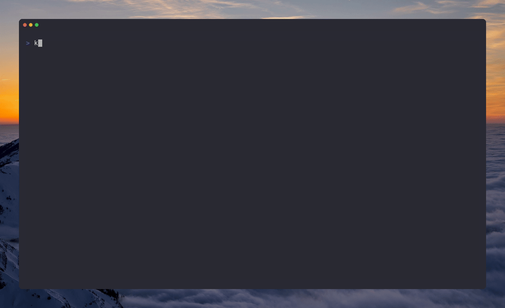
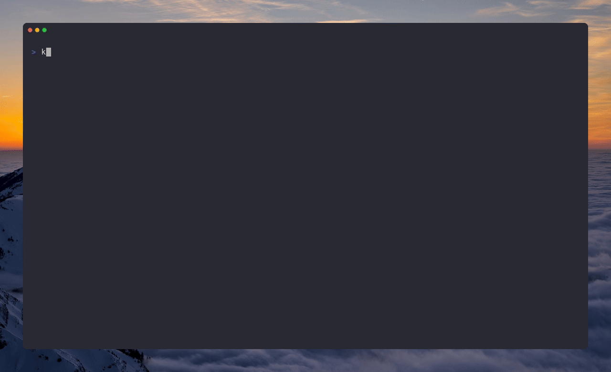

<p align="center">
  
</p>

<p align="center"><strong>Interactive security triage in the terminal.</strong></p>

<p align="center">
  
  
  
  
  
</p>

---

# Kekkai

**Stop parsing JSON.**

Kekkai is a small open-source CLI that wraps existing security scanners (Trivy, Semgrep, Gitleaks) and focuses on the part that tends to be slow and frustrating: reviewing and triaging results.

Running scanners is easy. Interpreting noisy output, dealing with false positives, and making CI usable is not. Kekkai exists to make that part tolerable.

**See it run:** `kekkai doctor` plus a single `kekkai scan` driving Semgrep, Gitleaks, and Trivy (Docker-backed), then a quick look at the unified `kekkai-report.json` on disk.



---

## What it does

- Runs Trivy (dependencies), Semgrep (code), and Gitleaks (secrets)
- Normalizes their outputs into a single report format
- Provides an interactive terminal UI for reviewing findings
- Lets you mark findings as false positives and persist decisions locally
- Supports CI mode with severity-based failure thresholds

Kekkai does not replace scanners or introduce proprietary detection logic. It sits on top of existing tools and focuses on workflow and UX.

---

## Feature Summary

| Feature | Description |
|---------|-------------|
| **Unified scanning** | One command runs Trivy, Semgrep, and Gitleaks via Docker |
| **Single report format** | All findings normalized into `kekkai-report.json` |
| **Interactive triage TUI** | Keyboard-driven UI to review, confirm, or dismiss findings |
| **False positive management** | Mark findings and persist decisions with `.kekkaiignore` |
| **CI mode** | `--ci --fail-on critical,high` with structured exit codes |
| **GitHub PR comments** | Post findings inline on pull requests |
| **DAST with OWASP ZAP** | Point at a running service for a baseline web scan (opt-in) |
| **ThreatFlow** | Local-first AI threat modeling via Ollama (opt-in) |
| **DefectDojo integration** | Spin up a local vuln management dashboard (opt-in) |
| **Compliance reporting** | HTML/PDF reports with PCI-DSS, OWASP, HIPAA, SOC 2 mappings |
| **AI fix engine** | Generate code patches for findings (experimental, opt-in) |
| **Container hardening** | Read-only FS, no network egress, 2 GB memory limit per scanner |

---

## Quick Start

> Requires Docker and Python 3.12

### Install

```bash
pipx install kekkai-cli
```

### Common starting points

**Scan and triage a repository:**

```bash
# 1. Verify prerequisites
kekkai doctor

# 2. Scan current directory (Trivy + Semgrep + Gitleaks)
kekkai scan

# 3. Review findings interactively
kekkai triage
```

**Wire into CI and get PR comments:**

```bash
# Generate a GitHub Actions workflow
kekkai init --ci

# Or add the step manually:
# kekkai scan --ci --fail-on critical,high --pr-comment
```

### Auto-Install (Pre-commit)

Add this to your `.pre-commit-config.yaml` to scan on every commit:

```yaml
  - repo: https://github.com/kademoslabs/kekkai
    rev: v2.0.1
    hooks:
      - id: kekkai-scan
```

No signup, no cloud service required.

---

## Why Kekkai?

| Problem | Kekkai Solution |
|---------|-----------------|
| **Juggling 3+ tools** | One CLI for Trivy, Semgrep, Gitleaks |
| **Reading JSON logs** | Interactive terminal UI |
| **Installing scanners** | Auto-pulls Docker containers |
| **Parsing different formats** | Unified `kekkai-report.json` |
| **False positives** | Mark and ignore with `.kekkaiignore` |
| **CI/CD integration** | `kekkai scan --ci --fail-on high` |

---

## Features

### Interactive Triage TUI

Stop reading JSON. Use keyboard navigation to review findings, mark false positives, and generate ignore files.

```bash
kekkai triage
```

**Controls:**
- `j/k` or `↑/↓`: Navigate findings
- `f`: Mark as false positive
- `c`: Confirm finding
- `d`: Defer/ignore
- `Ctrl+O`: Open in editor at vulnerable line
- `Ctrl+S`: Save decisions
- `q`: Quit


[Full Triage Documentation →](docs/triage/README.md)

---

### CI/CD in 1 Second

Don't write YAML. Run this in your repo:
```bash
kekkai init --ci
```

[Full CI Documentation →](docs/ci/ci-mode.md)

---

### GitHub PR Comments

Get security feedback directly in pull requests.

```bash
export GITHUB_TOKEN="ghp_..."
kekkai scan --pr-comment
```
---

### Unified Scanning

Run industry-standard scanners without installing them individually. Each scanner runs in an isolated Docker container.

```bash
kekkai scan                          # Scan current directory
kekkai scan --repo /path/to/project  # Scan specific path
kekkai scan --output results.json    # Custom output path
```

**Scanners Included:**
| Scanner | Finds | Image |
|---------|-------|-------|
| Trivy | CVEs in dependencies | `ghcr.io/aquasecurity/trivy:0.69.3` |
| Semgrep | Code vulnerabilities | `semgrep/semgrep:latest` |
| Gitleaks | Hardcoded secrets | `zricethezav/gitleaks:latest` |

#### DAST with OWASP ZAP (optional)

Point Kekkai at a **running** HTTP service for a baseline ZAP scan. On Linux, `127.0.0.1` / `localhost` targets are rewritten so the ZAP container can reach your host (via `host.docker.internal` + `host-gateway`).

```bash
kekkai scan --scanners zap \
  --target-url 'http://127.0.0.1:5000' \
  --allow-private-ips
```


**Container Security:**
- Read-only filesystem
- No network access
- Memory limited (2GB)
- No privilege escalation

---

#### Design choices

- Local-first: no SaaS required, runs entirely on your machine or CI
- No network access for scanner containers
- Read-only filesystems, memory-limited containers
- Uses existing tools instead of reimplementing scanners
- Terminal-first UX instead of dashboards

---

## Optional features

These are opt-in and not required for basic use:

### Local-First AI Threat Modeling

Generate STRIDE threat models with AI that runs on **your machine**. No API keys. No cloud.

```bash
# Ollama (recommended - easy setup, privacy-preserving)
ollama pull mistral
kekkai threatflow --repo . --model-mode ollama --model-name mistral

# Output: THREATS.md with attack surface analysis and Mermaid.js diagrams
```

**Supports:**
- Ollama (recommended)
- Local GGUF models (llama.cpp)
- OpenAI/Anthropic/Gemini (if you trust them with your code)

[Full Local-First AI Threat Modeling Documentation →](docs/threatflow/README.md)


---

### DefectDojo Integration

Spin up a vulnerability management dashboard locally if you need it.

```bash
kekkai dojo up --wait    # Start DefectDojo
kekkai upload            # Import scan results
```

**What You Get:**
- DefectDojo web UI at `http://localhost:8085` (default HTTP port; override with `kekkai dojo up --port …`)
- Automatic credential generation
- Pre-configured for Kekkai imports

[DefectDojo Quick Start →](docs/dojo/dojo-quickstart.md)

---

### AI-Powered Fix Engine

Generate code patches for findings (experimental).

```bash
kekkai fix --input scan-results.json --apply
```

---

### Compliance Reporting

Turn a unified `kekkai-report.json` into **HTML** (or PDF, compliance matrix, etc.) with executive summary and framework mapping (PCI-DSS, OWASP, HIPAA, SOC 2).

```bash
kekkai report --input kekkai-report.json --format html --output ./reports --project my-service
```

The demo below runs a fast Semgrep-only pass to refresh the JSON, then renders HTML and lists the output directory.



```bash
# Other formats
kekkai report --input kekkai-report.json --format pdf --frameworks PCI-DSS,OWASP
```

---

## What this is not

- Not a replacement for commercial AppSec platforms
- Not a new scanner or detection engine
- Not optimized for large enterprises (yet)
- Not a hosted service

Right now, Kekkai is aimed at individual developers and small teams who already run scanners but want better triage and less noise.

---

## Security

Kekkai is designed with security as a core principle:

- **Container Isolation**: Scanners run in hardened Docker containers
- **No Network Access**: Containers cannot reach external networks
- **Local-First AI**: run entirely on your machine
- **SLSA Level 3**: Release artifacts include provenance attestations
- **Signed Images**: Docker images are Cosign-signed

For vulnerability reports, see [SECURITY.md](SECURITY.md).

---

## Documentation

| Guide | Description |
|-------|-------------|
| [Installation](docs/README.md#installation-methods) | All installation methods |
| [ThreatFlow](docs/threatflow/README.md) | AI threat modeling setup |
| [Triage TUI](docs/triage/README.md) | Interactive finding review |
| [CI Mode](docs/ci/ci-mode.md) | Pipeline integration |
| [DefectDojo](docs/dojo/dojo-quickstart.md) | Optional vulnerability management |
| [Security](docs/security/slsa-provenance.md) | SLSA provenance verification |

---

## Roadmap (short-term)

1. Persistent triage state across runs (baselines)
2. "New findings only" diffs
3. Better PR-level workflows
4. Cleaner reporting for small teams

---

## Contributing

We welcome contributions! See [CONTRIBUTING.md](CONTRIBUTING.md) for guidelines.

---

## License

Apache-2.0 — See [LICENSE](LICENSE) for details.

---

<p align="center"><i>Built by <a href="https://kademos.org">Kademos Labs</a></i></p>
